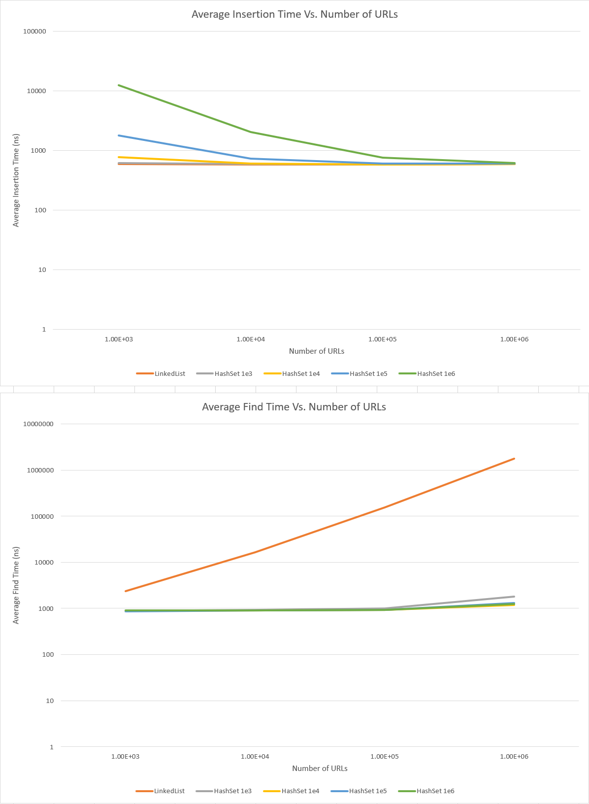

# CSE 109 - Final Exam

**Before you start on this exam, read everything *thoroughly* top to bottom**

Spring 2020

## Ethics Contract

**FIRST**: Please read the following carefully:

-	I have not received, I have not given, nor will I give or receive, any assistance to another student taking this exam, including discussing the exam with students in another section of the course. Do not discuss the exam after you are finished until final grades are submitted.
-	I will not plagiarize someone else's work and turn it in as my own. If I use someone else's work in this exam, I will cite that work. Failure to cite work I used is plagiarism.
-	I understand that acts of academic dishonesty may be penalized to the full extent allowed by the Lehigh University Code of Conduct, including receiving a failing grade for the course. I recognize that I am responsible for understanding the provisions of the Lehigh University Code of Conduct as they relate to this academic exercise.

If you agree with the above, type your full name in the following space along with the date. Your exam **will not be graded** without this assent.

*** Writing your name and the date below binds you to the above agreement

Asher Hamrick 5/6/2020

*** Writing your name and the date above binds you to the above agreement

## Prelude

First of all, we're going to do things the same way we did them in Exam 2. You must have at least one commit per question. For each question, subsequently add the hash of the first commit for that question in this README at the indicated space. I think pretty much everyone got this right on Exam 2, so just do the same thing here.

What you're going to do for this exam is benchmark your linked list and hash set implementations. This is the "science" part of computer science. You've already implemented some data structures, and now it's time to see how they perform relative to one another and compare that to what the theory states. Until now we've been using our data structures on very small datasets. I've included a large dataset of 1 million URLs in this repository. I've broken it up into files of varying size because the full 1 million can be hard to work with. Get your program working with the smaller dataset first, and then ramp up to the larger ones. You can complete this exam without getting up to the full 1 million, but I'd like you to get at least to 10^5 elements.

Just like Exam 2 there will be two parts. First you'll right some code, then you'll answer some questions. For part 1, you are going to be implementing a program in main.c that will read a file of URLs, and then insert the entires into a datastructure (either a linked list or a hash set, depeing on what you are measuring). You will time how long it takes to insert entires into the data structure, and then also how long it takes to find them.

For timing, I've got an example of measuring how much time elapses in a program working here: https://repl.it/repls/QuarterlyWelltodoChapters

You are free to use any other methods that you see fit, but this is just an example.

For reading files, you can use stdio: http://www.cplusplus.com/reference/cstdio/
Here is a source with some examples: https://www.tutorialspoint.com/cprogramming/c_file_io.htm

You can get your project started without reading files by copy/pasting string literals into the main.c source. But only do that for a couple strings. When you want to read in thousands of strings, you should switch to reading a file.

**Keep in mind** This is a very open ended exam. I do not care so much about the code you write. What I really care about are two things:

1. That you collect some data
2. That you analyze that data.

Questions 6 and 7 are basically "generate the data table" that you see below. It's up to you how you want to do this. You can write a single program that does it all automatically in one pass, or you can do it manually by changing your main.c code each time. Remember to commit your code though if you change it after each pass.

## Part 1

You will write a program that reads URLs from a file. You will use these URLs to build the following 5 data structures

1. 1e3/1e4/1e5/1e6 URLs – Linked List
2. 1e3/1e4/1e5/1e6 URLs – Hash Set with 1e3 Buckets
3. 1e3/1e4/1e5/1e6 URLs – Hash Set with 1e4 Buckets
4. 1e3/1e4/1e5/1e6 URLs – Hash Set with 1e5 Buckets
5. 1e3/1e4/1e5/1e6 URLs – Hash Set with 1e6 Buckets

You will generate some statistics for each data structure.

1. Record the average insertion time for each data structure.
2. Record the average find time for each data structure.

In the end you will have 5 data structures with two measurements each. You will make a data table that looks like this:

Table 1:
```
Average Insertion Time (ns)
n                  1e3     |      1e4      |       1e5     |      1e6      |
Linked List                |               |               |               |
Hash Set 1e3               |               |               |               |  
Hash Set 1e4               |               |               |               |
Hash Set 1e5               |               |               |               |
Hash Set 1e6               |               |               |               |

Average Find Time (ns)
n                  1e3     |      1e4      |       1e5     |      1e6      |
Linked List                |               |               |               |
Hash Set 1e3               |               |               |               |  
Hash Set 1e4               |               |               |               |
Hash Set 1e5               |               |               |               |
Hash Set 1e6               |               |               |               |
```

Where each cell will contain the average insert or find time in nanoseconds.

### Question 1

Lay out your directory. Create a src folder, a lib folder, a include folder, and a blank Makefile. 

- Inside the `src` folder create a `bin` directory. 
- Inside the `src/bin` directory create `main.c`
- Inside the `src` directory create `lib.c`. lib.c is for implementing any helper functions you want to use in `main.c`. The only function in `main.c` should be `main()`.
- Inside the `include` directory add `benchmarker.h`

Hash: 87af357b47c74667d581dbb0b158ef351da7cf85

### Question 2

Build your linked list and hash set libraries from previous homeworks and place them in the lib directory, along with their respective header files.

Hash: cc11a87feedfbbc362c9ebafa1bbe646a19d866b

### Question 3

Implement the Makefile to build your project.

- `make` will build `main.c`, linking to `liblinkedlist.a` and `libhashset.a`. All object files should be placed in build/objects and all binary executables should be placed in `build/bin`.
- `make lib` will make `libbenchmarker.a` and put it in `build/lib`.
- `make clean` will clean the project of all build artifacts (*.o main). It shouldn't get rid of the libraries in `lib`

Hash: 060b6ee2c110e168f18e2a39269f5ce265c39691

### Question 4

In `main.c` have it read in a single argument from the command line. This argument will be the file to read in when you call main.c. For example you will call

```
./main urls100.txt
```

And your program will then read in urls100.txt line by line. Don't do the file reading yet though, that's the next question. Just read the argument in this question.

Hash: ece71bfb0ecde47dd08db62315720f5a5255220d

### Question 5

Read in the supplied file.

Hash: ee842e2a4ee4e50d7b9d55e904f0e22ab0fe52d4

### Question 6

Write code to generate data for average insertion time for each of the 5 data structures. For each data structure, you'll create an empty data structure, then insert N items into it, and time how long that takes, then divide the result by the number of elements inserted.

For example, if it takes 1000 nanoseconds to insert 100 items into a linked list, that's an average of 10 ns per item.

Final Pass Hash: f553b7d10d5050b2d36718dbc05b7762a0ff0496

### Question 7

Write code to generate data for average find time for each of the 5 data structures. To do this, you'll first have to populate an empty data structure with some items (Question 6). Then, time how long it takes to find each item in that data structure and get the average.

For example, if I insert 100 items into a linked list, then I can run a loop and find those 100 items in the linked list. Time how long that takes and divide by 100.

Hash: 4af8a09ee967337bf22da1764f9822a0276c6535

## Part 2

### Question 8

Describe your method for generating the data in Table 1.

In order to generate the data which I placed into table 1, I first declared and allocated memory on the heap 4 different hashset pointers (hashsets on the heap) and a LinkedList pointer (a list on the heap). I then initialized the data structures using the initList() and initHashSet() methods. I used the FILE struct and the fopen() method with argv to open the file which was passed through the command line arguments, and i used the fgets() method in a while loop to loop through every url in the file. In lib.c, I created a method for determining the insert time for one item of a hashset and another for determining the insert time for one item of a linked list. I did this by embedding the insertItem() methods for each data structure (insertTail() for the linked list) into the start and the end time calculator (as demonstrated by the provided repl.it at https://repl.it/repls/QuarterlyWelltodoChapters) and calculated the total insert time and returned it. I then called the method on each respective data structure, and added the result to an insert time variable I created for each. While the loop executed, I kept a counter, so that I could know how many urls were in the file. After every piece of data was added to each data structure, and the sum of all the single url adding for each structure completed (during the loop), I divided each result by the number of urls to get an average insert time. I then printed these insert times out for each data structure and I was able to copy and paste the result into the data table. I ran the program for each url file, in order to get the result for all of the input sizes. 

Hash: 78c5d1a0bb939f360d2bf3e9d911e64043d1ce24

### Question 9

Describe what if any trends you see in the data.

The trends that I see in the data for insertions are that the average insertion time for for each url appears to decrease as there is a greater number of urls. For the HashSets, this can be explained by the fact that there is an initial time cost to initializing the HashSet and calculating the hashes, but by adding more urls, the time it takes to initialize the HashSet and resize the hashset is spread out among more urls for the average, decreasing the average. As for the Linked List, a similar phenomenon occurs, there is some time spent initializing the linked list when the first item is inserted, but spreading this across more urls with its constant insert time, causes a decrease in the average insert time. As for find time, the HashSets stay relatively constant throughout, but the linked list increases dramatically each time. This is because the linked list has to search through every url up to the one that it wants to find it, where as hashsets only have to search through a small number of urls that correspond to its particular hash.

Hash: 91e8a4c3e62008fca3df118643b61c73a0d3586a

### Question 10

What does the theory say the results should be? Do your findings match your expectation? What factors could have influenced your results?

Based on theory, insert time for a linked list and a hashset are constant O(1), and therefore the insert time should stay relatively similar. This was generally backed up. There was a small decrease in average insert time for both of them, however this is due to the initial costs of the hashset and linkedlist increasing time at the beginning, which as more urls were added, decreased its impact on the overall. As for finding urls in the data structures, theory says that linkedlists have a linear O(n) find time and HashSets have a constant O(1) find time at the expense of taking up much more memory. This was definitely backed up by the data as when the number of urls increased, the average find time for the linkedlist increased dramatically (about 10x each time which makes sense since the number of urls increased 10x), and the HashSets did stay relatively constant in find time as they were expected to within a small margin of error. So the results stayed generally consistent with what theory would cause me to expect to occur. In general, because of only specifically timing one line of code for each (the specific insertion or finditem operation) the range of factors influencing timing was relatively small. The most likely suspect would have just been differentiated run time in the computer itself, causing one pass to be slightly slower or faster than another for no theory-explained reason.

Hash: 6dae30efab73af7a005d17691f80c10f133ab381

### Question 11

Include two graphs that summarize your results
  - One graph that depicts n versus average insertion time for each of the 5 data structures
  - One graph that depicts n versus average search time for each of the 5 data structures
  - I suggest a log scale on the Y axis for average find time.
  - Each graph will have 5 data series with 4 data points each for a total of 20 data points per graph
  - Be sure to embed both graphs in your report using Markdown.
  - You can draw the graphs using any program you are familiar with (I suggest Excel or its equivalent on other platforms). Export your graphs from these programs in a common format though (jpg, png, or pdf).
  - Also include the underlying data (e.g. the Excel file you used to generate your graphs)
  - I've included example graphs here to give you an idea of what they look like. Don't worry if yours don't not look like this. There are a million factors that play into the results you ultimately get. Your job is to get the data, and then provide an analysis of the data. There are no "right" data. If your data does not match the theory, explain why. If it does match, explain how.

  I consulted https://stackoverflow.com/questions/41604263/how-to-display-local-image-in-markdown on how to display images in markdown. Question 10: 6dae30efab73af7a005d17691f80c10f133ab381 is my explanation for why the data matches the theory.

  Note: All of the series are on both of the graphs, the data for a few of the HashSets was very similar for all tests and so they are on top of each other in some cases, but they are all there.

  

Hash: 45ef09f6a236df2f2a9100e0abce8efa13741f75

## Postscript

Alright, that's it. Have this in by Monday at 5pm, and then have a great summer!